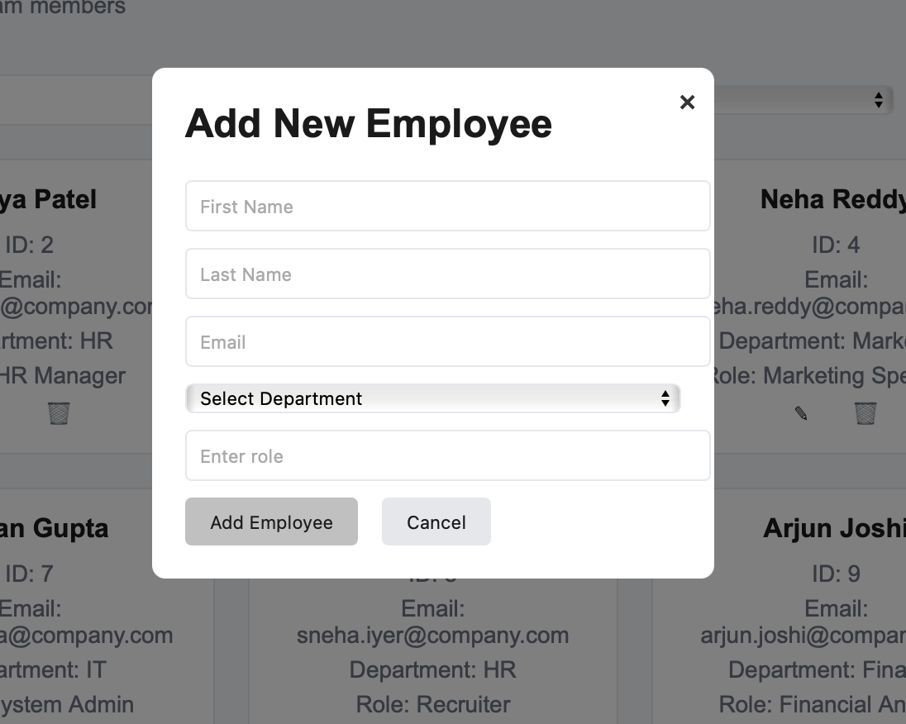

# Employee Directory App

Welcome to the Employee Directory App! This is a simple web application to manage a list of employees, designed with a clean and user-friendly interface. It allows you to view, add, edit, delete, search, sort, filter, and paginate through employee details.

## Features
- **View Employees**: Display a grid of employee cards with names, IDs, emails, departments, and roles.
- **Add Employee**: Add new employees using a popup form.
- **Edit Employee**: Update existing employee details with the edit button on each card.
- **Delete Employee**: Remove employees with a confirmation prompt.
- **Search**: Search employees by name or email.
- **Sort**: Sort employees by first name or department.
- **Filter**: Filter employees by name, department, or role using a filter popup.
- **Pagination**: Navigate through pages with 10, 20, or 50 employees per page.

## Setup Instructions
1. **Download the Code**:
   - Clone this repository or download the `employee-directory` folder.
2. **Folder Structure**:
```
employee-directory/
├── css/
│   └── style.css
├── js/
│   └── app.js
└── index.html

```
3. **Open the App**:
- Open `index.html` in any web browser (like Chrome or Firefox) by double-clicking it or using `live server` if you have it installed.
4. **No Extra Tools Needed**:
- The app runs locally with just HTML, CSS, and JavaScript—no server required!

## How to Use
- **Search**: Type in the search bar to find employees.
- **Sort**: Use the dropdown to sort by first name or department.
- **Add Employee**: Click "+ Add Employee" to open the form and fill in details.
- **Edit/Delete**: Click ✎ (edit) or 🗑 (delete) on a card to modify or remove an employee.
- **Filter**: Click "Filters" to apply filters by name, department, or role.
- **Pagination**: Use the page buttons (e.g., 1 2 ... 5) and «« « » »» to navigate.

## Screenshots
Add screenshots to show how the app looks! Here’s how to include them:
1. Take screenshots of the app:
- Open `index.html` in your browser.
- Capture the initial view (with the header and controls).
- Capture the pagination view (e.g., with page 2 selected).
- Use a tool like Snipping Tool (Windows), Shift+Command+4 (Mac), or your phone to take pictures.
2. Save the screenshots in the `employee-directory` folder (e.g., `screenshot1.png`, `screenshot2.png`).
3. Add them to this file like this:
- Replace the placeholder paths below with your file names.
- Example:
  ```markdown
  <image-card alt="Initial View" src="./screenshot1.png" ></image-card>
  <image-card alt="Pagination View" src="./screenshot2.png" ></image-card>
  
  
  ```
